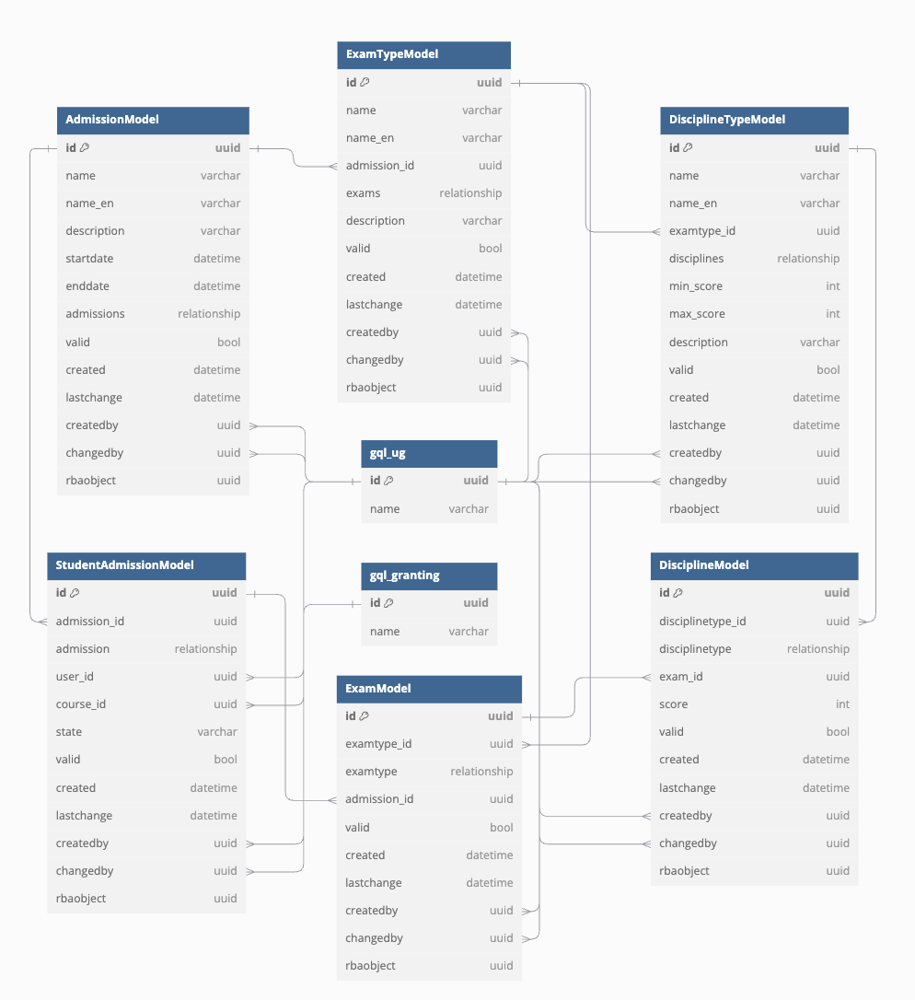

# GQL_Admissions - Deníček

__Tomáš Kyseľ,__ 
__Jakub Vágner,__ 
__Lukáš Zdražílek,__ 
________________________________________________________________________

  
  

Pracujeme s UG (user), GRANTING a DOCUMENTS

- Otevření, uzavření přihlášky
- Více programů studia
- Stejná user struktura
- Autentizace neřešit (generace login, hesla, nebo přes soc. sítě)
- 1 uložení přihlášky, 2. odeslání přihlášky (lze vzít zpět do konce přihlašování)
- UG má state transition, state machine, vygenerovat (podaná, odeslaná, vzatá zpět)
- Vymazat nebo archivovat minulé přihlášky?
- Více zkoušek = relace 1 ku N, přihláška má testy, tabulka testů cizí klíč, ke které přihlášce se vztahuje, disciplíny cizí klíč na test
- Přihláška = propojení studenta a programu, program = předměty, předměty = disciplíny
- Jednotná entita disciplíny pro všechny
- Fakulty sdílí testy (nechat být)
- Přidat percentil umístění
- Peníze neřešit
- Práva ke čtení userů budou řešeny přes skupiny
- User bude mít stavovou entitu (Přihlašuje se / Student)

- Dle evolution vytvoření struktur databází

### Rozvržení databáze

## Aktuální úkoly

- [x] Fork hrbolek/gql_events jako template pro naše Admissions a nasdílet

- [x] Udělat hrubý náčrt databázové struktury

- [] Seznámení se se stylem tvoření reálné databázové struktury (gql_events/src/DBDefinitions.py)

- [] Vytvoření reálné databázové struktury s parametry pro gql_admissions

________________________________________________________________________

## Harmonogram skupinové práce pro Admissions část IS

__7.10.2024__ vybraná témata, publikované repositories

__11.10.2024__ analýza kódu 5_SQLalchemy 

__7.11.2024__ 1. projektový den, doložení kompletních descriptions (gql modely)

__9.12.2024__ 2. projektový den, doložení funkcionality (crud)

__29.1.2025__ 3. projektový den, doložení testů
